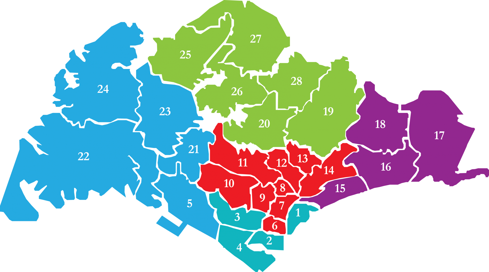
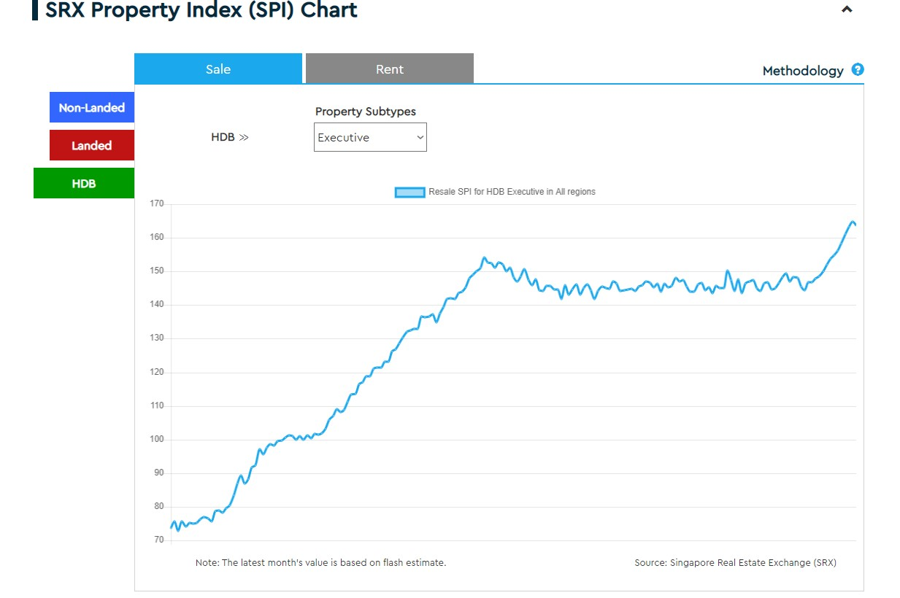
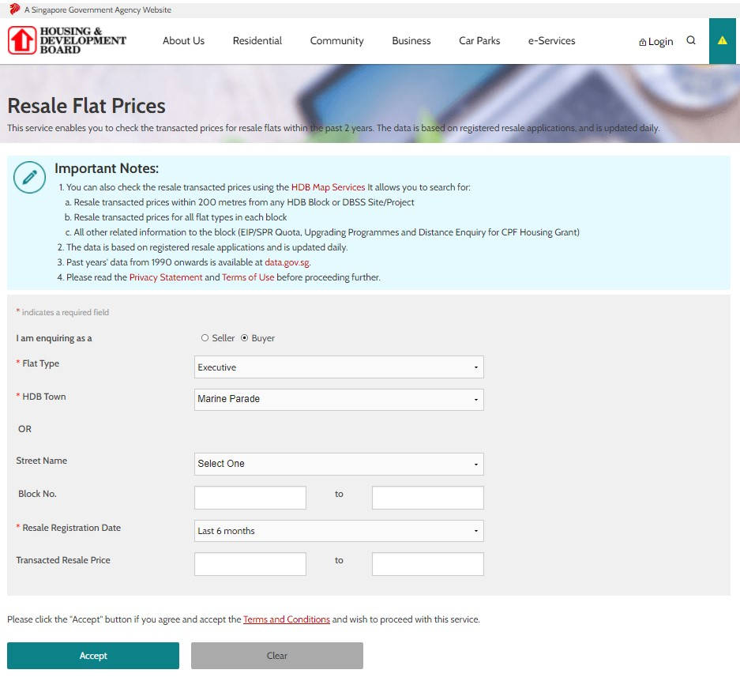
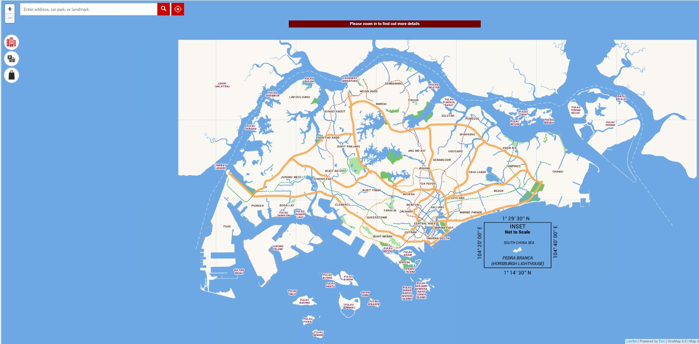
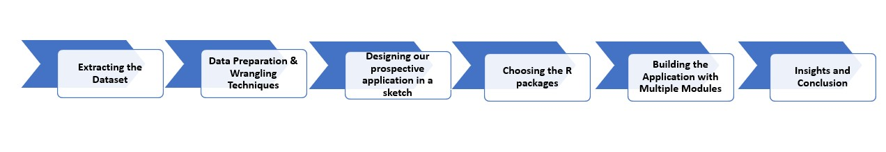
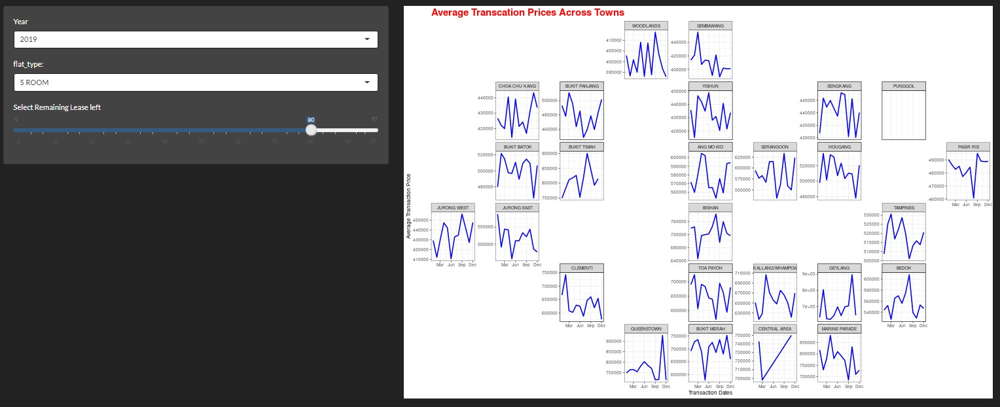
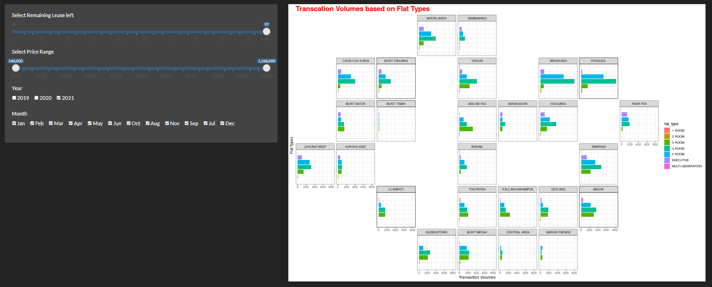
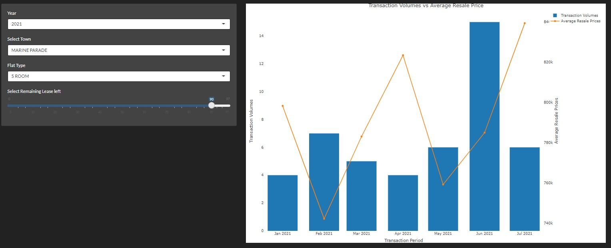
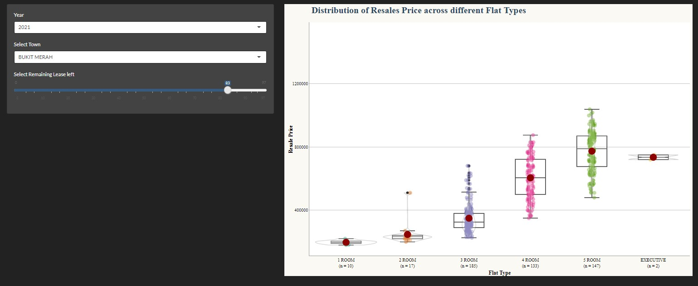
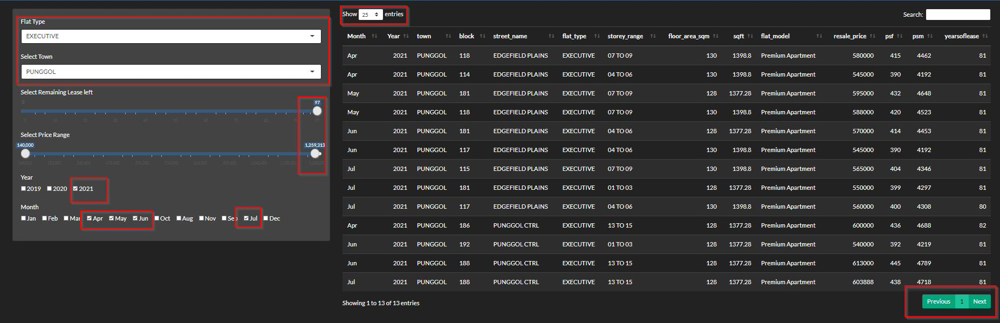

# Motivation

HDB spans across the island in all estates. Some estates have more units owing to the density of the population while some estates have lesser units owing to the facilities and other infrastructure in the vicinity. The government has ensured basic facilities to be provided across all HDB estates such as transportation, bus service to nearest MRT, supermarkets, hawker centres, medical clinics, neighbourhood schools and child-care centres.



Regardless of facilities, people do have preferences on which estate/town they want to live at. It could be due to their childhood, proximity to parents and relatives, school admission of the children, commute to work, etc are some of the common reasons. The behaviour and frequent transactions drive the prices of HDBs in certain estates higher than the others.

We extracted the raw transaction data of HDBs from 2019 and analysed the pricing behaviour by towns, flat type and even remaining years of lease. The idea of an application for users to provide a one-stop solution to visually review the transaction history and quickly view the trend by various factors is motivating for us. An application such as this would be beneficial to our users who want a consolidated view of the market history.

# Literature Review
## SRX Website
1.	Whie performing research on the property of Singapore, we came across application from SRX – a property sale site. There is an application within the website to show the pricing trend. The chart is visually not very attractive and has many missing components that would benefit the users. 


### Clarity & Aesthetic Issues
•	The chart is a timeline graph, but it has no time stated in the X axis. One cannot tell if the chart is for a certain period.

•	The selection is only by HDB, Landed and non-Landed. There is no further segregation by size and, flat type. The absolute $ variation by flat type would vary. Hence, it is not good to aggregate the values as a single line graph.

•	Finally, there is no mention of town or estate in the graph. A price variance in downtown may not be equivalent to the price variance in suburbs. Multiple factors affect the trend and that must be considered before dwelling into the pricing trend.

•	Overall, the graph is not impressive, and it fails to tell any story to the user.
Website (https://www.srx.com.sg/price-index#)

## HDB website: 
There are 2 links within the HDB site to provide the resale transactions of the HDBs within the last 2 years. They are a data table which a user can retrieve only by keying in exact specific details (down to the street level) and a geospatial map that provides further insights on amenities (a search function by street level).
(https://services2.hdb.gov.sg/webapp/BB33RTIS/BB33PReslTrans.jsp)
(https://services2.hdb.gov.sg/web/fi10/emap.html)



### Clarity & Aesthetic Issues
•	While HDB website is the most authentic source of data, it does not provide any visual analysis of the resale transactions done in the last few years. 

•	There are no trend lines / graphs for users to compare prices in a single interactive dashboard.

•	There are no searches available as a consolidated view for users to use the function to compare and understand the trends. 

•	There are generic guidelines on flat types and sizes but no trends to show the pricing variance of flat types in various estates.

•	These are important considerations that one makes while purchasing their first home. These must be catered to for a user-friendly experience.




# Data Analysis Methodology

## The Planning
We decided to approach a 6-step strategy for performing the property pricing analysis. The steps would span right from data extraction to the final insights we obtain based on the data analysis performed. The 6 steps would consist of:



## Data Extraction
Data was extracted from Singapore Government’s Public Data Website (https://data.gov.sg/dataset/resale-flat-prices). This is a reliable and authentic government website source.

The data consisted of resale prices from 1990 onwards till July 2021. However, data is very fluid, and we are only interested in years from 2019 Jan till 2021 Jul. Reason being, property prices are like stocks. They change radically given a change in circumstance. We are keen to observe how the prices were pre-Covid, during Covid and almost-post Covid with high vaccination rates. With projects getting delayed (due to shortage of labour), many resale HDB prices went up. We do not know how the pricing will be in future, but we can provide the trend from 2019 (pre-Covid) to show the users how the resale market was.

## Data Preparation and Wrangling
We used *dplyr package* to filter the data. This gave us data from 2019 onwards. We further used *tidyverse, lubridate and clock packages* to wrangle the data and bring them to a usable format. We did not aggregate any of the transactions as we wanted to use the actual individual transactions for the analysis.

## Data Analysis Steps
Using Shiny Package in R, we built a holistic application for users to navigate through various town and browse the property pricing. We built 3 modules in the application.

### Geo-Facet Mapping
Using *Geofacet Package* in R, we built 2 visuals: Geofacet of transaction volumes by town and Geofacet of average pricing by town. Geofacet is useful here because it provides a flexible way to visualise data for different geographic locations in Singapore and compare the results. Visually, this is attractive as it plots itself like the overall topology of the country.

Geofact is helpful because a user can identify which estates have higher transaction volumes (possibly due to large estate size or even due to high demand of housing in the estate). The Geofacet of average pricing would enable a user to narrow down the list of estates where he/she wants to further drill down to analyse the trend further. Geofacet has been built in the form of the Singapore map with individual line graphs within the town.

### Resale Pricing Analysis by Transaction Volume
Using *Plotly package* in R, we built a simple chart to showcase the transaction volume with average resale pricing. This is an interactive chart whereby the user can filter by year, by flat type and town to see the trend. This is useful because it provides a trend over time on how the resale market worked.

### Resale Pricing Analysis by Flat-Type (Boxplot)
Using the *plotly package*, we built box plots for all towns using the flat-type as a base to determine the mean and median pricing of the flats across towns. Users can check for outlier transactions using this chart and check for towns where transactions are higher/lower depending on their needs.

### Interactive Dashboard – Let the User Choose
The final module used in the application is the interactive dashboard that allows users to choose the factors by town and perform a deep dive analysis. This is important after the first 2 modules whereby an overall comparison of towns is shown. Once the user narrows down his list of towns, he can deep dive further by selecting the town and other factors.  This dashboard is the unique selling point of our application. The module is built using a combination of packages such as *plotly*, *ggplotly*, *zoo*.

# Insights and Next Steps
Based on the initial analysis performed, it did seem like the property prices have increased in the last 2 years. There could be multiple factors which constitute to the change. Since our resale data does not have the information, we will refrain from providing further comments on the change. As a next step, we would like to extract inflation, stock exchange index, and perform statistical analysis to understand the correlation between property prices and the economic indicators.

Based on the dashboard, below are some of the outputs of the charts performed for 2021. This is to show how the market is moving this year.

## Geofacet Charts Review:
It is interesting to note that 4 room flats in Seng Kang and Punggol have had the highest transaction volumes and are increasing. It could be due to the launch of BTO flats a few years ago making them available for resale in the last 2 years. There are many factors here if we look closely. 

•	The remaining years of lease is quite high suggesting fast purchase and sale of flats

•	They are steadily increasing since 2019 to 2021.

•	Despite high transaction volumes, the average pricing is not the highest in these estates.





## Transaction Volumes vs Average Pricing Review:
Once we use the Geo-Facet charts to observe the trend of different estates, we may navigate to the Transaction Volume tab to understand the trend of the shortlisted estates. Transaction volumes showed an upwards trend in 2021 Q2. However, by deep-diving into respective estates, we would know the trend for that estate. In certain estates, the transactions may be high and possibly due to sudden demand of housing in the area. That does not necessarily translate to high pricing. Pricing has many other driving factors such as distance from downtown, type of flats, size of flats, built year, etc.



## Resale Price Analyser

Once we use the transaction volume analyser to understand how the pricing moves for different estates in relation to volumes, we may want to deep dive further to understand the mean and median pricing in these shortlisted estates. This is an important indicator to identify if the pricing is stable (with low std deviation) or the range is wide with many outliers. Users can therefore choose estates which are stable or volatile based on their investment or housing needs.



## All Attributes Review by Town:
Upon reviewing and shortlisting the top few town choices, a natural action a buyer or seller would take is to view the detailed transaction prices based on his/her choice of flat. The below is an example of how the data search table would look like for a buyer with an intention to purchase an executive flat in Punggol with a high remaining year of lease. He would want to check all latest transactions up to the latest month for gaining real time insight. The application would show the user all results of transactions in Punggol for executive flats from April till July. A user would be able to select the attributes in this search table and view all transactions including the size of the flat in psf and psm terms. 



# The Realis-Guru Application
The link to the application is here: RealisGuru (https://realisguru.shinyapps.io/VAapp/)

# References
---
references:
- container-title: https://www.asiaone.com/money/how-hot-singapore-property-market-2021
  author: 
  - given: Stuart
  type: Website
  publisher: AsiaOne
  issued:
    year: 2021
    month: 6
---

- title: Edge Fair-Value
  container-title: EdgeProp Fair-Value
  URL: 'https://www.edgeprop.sg/analytic/edgefairvalue'
  publisher: Edge Prop
  type: Website
  issued:Web Version 4.5.136
...

```{r}
tinytex::install_tinytex()
```
